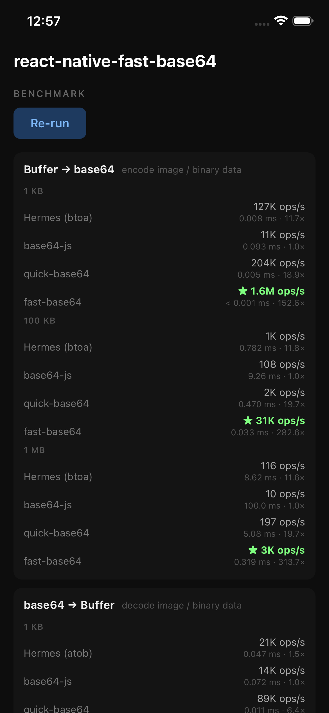
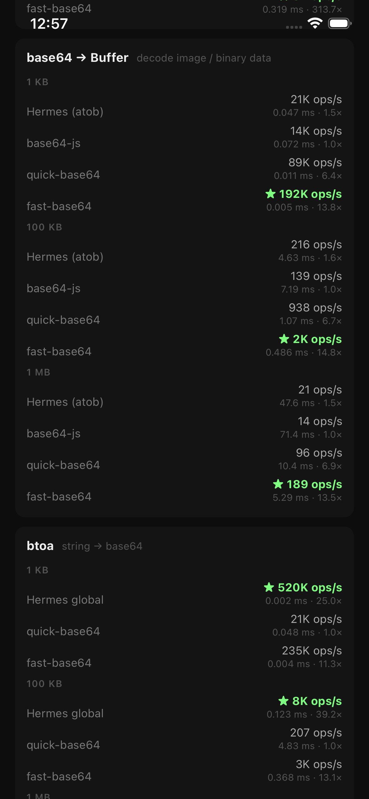
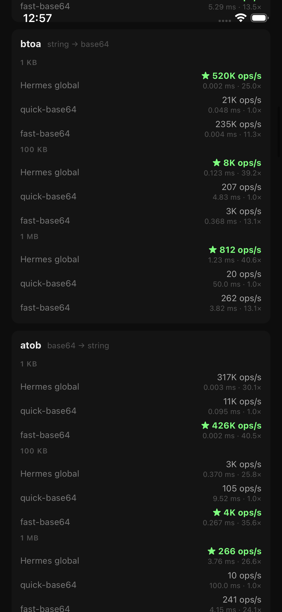
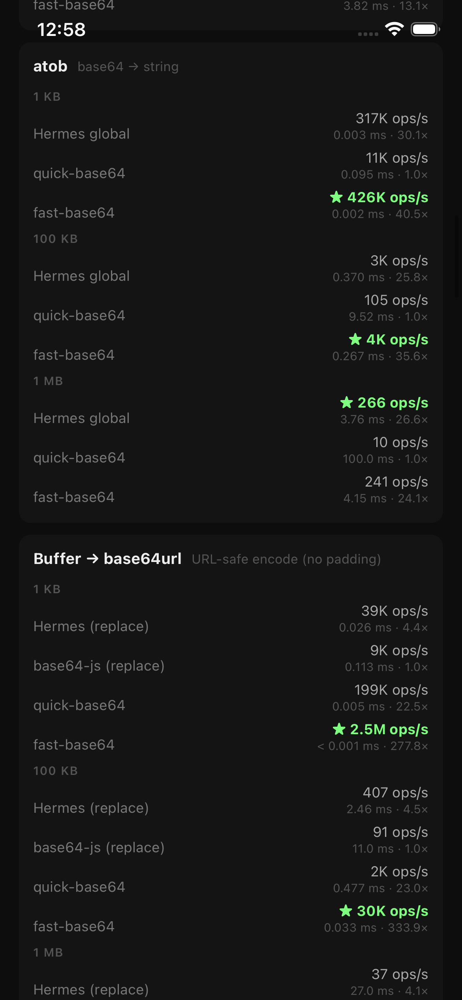
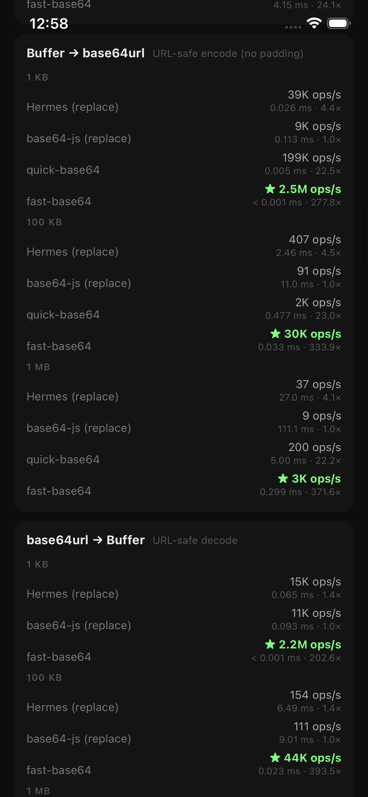
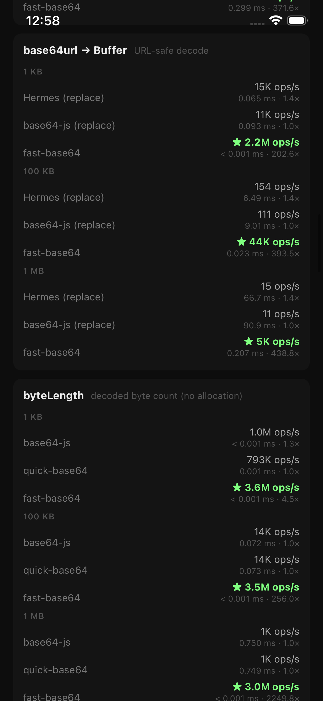
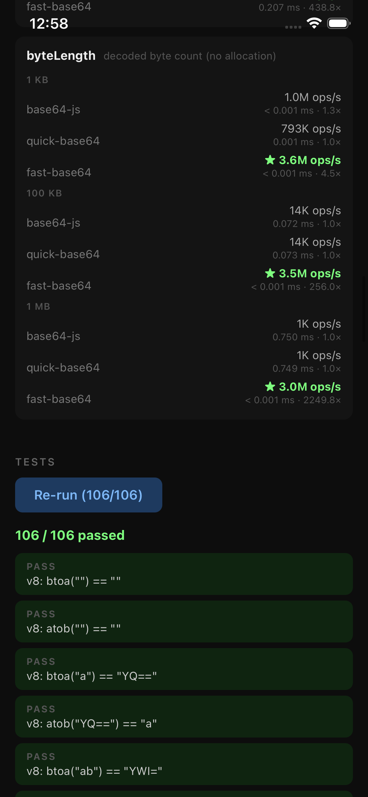
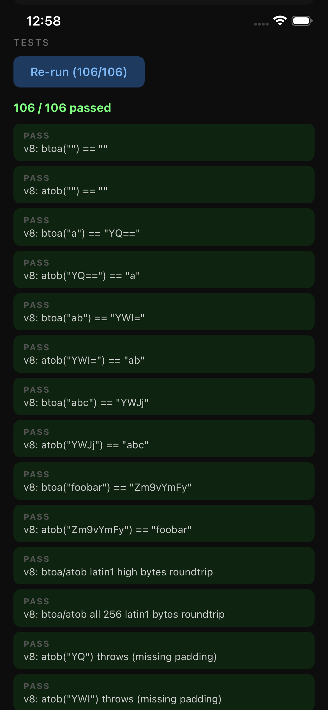

# react-native-fast-base64

A fast, native base64 library for React Native built with C++ and JSI. Powered by [simdutf](https://github.com/simdutf/simdutf) — the same SIMD-accelerated engine used by V8 and Node.js.

Three APIs in one package:

- **Web API** — `btoa` / `atob` for Latin-1 strings
- **Binary data** — `toBase64` / `fromBase64` / `toBase64URL` / `fromBase64URL` for `ArrayBuffer`
- **base64-js compat** — `fromByteArray` / `toByteArray` / `byteLength` as a drop-in replacement

---

## When to use this library

| I want to… | Use |
|------------|-----|
| Encode/decode a plain ASCII or Latin-1 string | `btoa` / `atob` |
| Encode/decode raw binary — images, files, crypto keys | `toBase64` / `fromBase64` |
| Produce URL-safe base64 — JWTs, filenames, query params | `toBase64URL` / `fromBase64URL` |
| Replace `base64-js` in existing code | `fromByteArray` / `toByteArray` / `byteLength` |
| Encode arbitrary text (UTF-8, emoji…) | `TextEncoder` + `fromByteArray` |

> **Note on `btoa` / `atob`:**
> Recent versions of Hermes include native `btoa` and `atob`. Check whether your runtime already provides them before polyfilling — these methods are here as a fallback and for cross-platform consistency.

---

## Benchmarks

Measured on an iPhone 16e simulator. Run the benchmarks yourself via the [example app](./example).

| | |
|-|-|
|  |  |
|  |  |
|  |  |
|  | |

Highlights at 1 KB:

| Operation | fast-base64 | vs. base64-js | vs. Hermes |
|-----------|------------|---------------|------------|
| Buffer → base64 | 1.7M ops/s | 149× | — |
| base64 → Buffer | 197K ops/s | 13× | — |
| Buffer → base64url | 3.0M ops/s | 310× | — |
| base64url → Buffer | 2.3M ops/s | 195× | — |
| btoa | 315K ops/s | — | 3.4× faster than Hermes global |
| atob | 477K ops/s | — | 1.4× faster than Hermes global |
| byteLength | 4.0M ops/s | 3.8× | — |

---

## Tests

106 tests covering TC39 spec vectors, base64-js compatibility, and C++ V8 port parity.



---

## Installation

```sh
yarn add react-native-fast-base64
```

```sh
cd ios && pod install
```

### Polyfilling globals (optional)

If your code — or a third-party library — calls `global.btoa` / `global.atob`, add this once to your entry point (`index.js` or `_layout.tsx`):

```ts
import FastBase64 from 'react-native-fast-base64';

// ??= assigns only when the value is null or undefined,
// so native Hermes implementations are not overridden.
global.btoa ??= FastBase64.btoa;
global.atob ??= FastBase64.atob;
```

---

## Usage

### Strings — `btoa` / `atob`

```ts
import FastBase64 from 'react-native-fast-base64';

FastBase64.btoa('Hello');     // → 'SGVsbG8='
FastBase64.atob('SGVsbG8='); // → 'Hello'
```

`btoa` accepts Latin-1 strings (code points 0x00–0xFF). It throws `InvalidCharacterError` for anything outside that range — emoji, CJK, etc.

For arbitrary text, encode to UTF-8 bytes first:

```ts
import { fromByteArray, toByteArray } from 'react-native-fast-base64';

const encoded = fromByteArray(new TextEncoder().encode('こんにちは'));
const decoded = new TextDecoder().decode(toByteArray(encoded));
```

### Binary data — ArrayBuffer

```ts
import FastBase64 from 'react-native-fast-base64';

const bytes = new Uint8Array([1, 2, 3, 255]);

// Standard base64 (RFC 4648 §4) — padded with =
const b64 = FastBase64.toBase64(bytes.buffer as unknown as Object) as string;
// → 'AAMD/w=='

// URL-safe base64 (RFC 4648 §5) — uses - and _, no padding
const b64url = FastBase64.toBase64URL(bytes.buffer as unknown as Object) as string;
// → 'AAMD_w'

// Decode back to ArrayBuffer
const ab = FastBase64.fromBase64(b64) as unknown as ArrayBuffer;
new Uint8Array(ab); // → Uint8Array [1, 2, 3, 255]
```

`fromBase64` and `fromBase64URL` both accept unpadded input — `'Zg'` is treated the same as `'Zg=='`.

`fromBase64URL` rejects standard `+` / `/` characters and throws on invalid input.

### base64-js drop-in

```ts
import { fromByteArray, toByteArray, byteLength } from 'react-native-fast-base64';

fromByteArray(new Uint8Array([102, 111, 111])); // → 'Zm9v'
toByteArray('Zm9v');                            // → Uint8Array [102, 111, 111]
byteLength('Zm9vYg==');                         // → 4  (O(1), no decoding)
```

Replace the import — no other changes needed:

```diff
-import { fromByteArray, toByteArray, byteLength } from 'base64-js';
+import { fromByteArray, toByteArray, byteLength } from 'react-native-fast-base64';
```

Typed array slices with a non-zero `byteOffset` are handled correctly:

```ts
const full = new Uint8Array([0, 102, 111, 111, 0]);
const slice = full.subarray(1, 4);
fromByteArray(slice); // → 'Zm9v'  ✓
```

---

## API reference

### Default export

| Method | Description |
|--------|-------------|
| `btoa(data: string): string` | Latin-1 string → base64. Throws for code points above U+00FF. |
| `atob(data: string): string` | Base64 → Latin-1 string. Throws for invalid input. |
| `toBase64(bytes: ArrayBuffer): string` | ArrayBuffer → standard base64 (RFC 4648 §4, padded). |
| `fromBase64(base64: string): ArrayBuffer` | Standard base64 → ArrayBuffer. Accepts unpadded input. |
| `toBase64URL(bytes: ArrayBuffer): string` | ArrayBuffer → base64url (RFC 4648 §5, no padding). |
| `fromBase64URL(base64url: string): ArrayBuffer` | Base64url → ArrayBuffer. Rejects `+` and `/`. |

### Named exports

| Function | Description |
|----------|-------------|
| `fromByteArray(bytes: Uint8Array): string` | Uint8Array → base64 string. Handles slices. |
| `toByteArray(base64: string): Uint8Array` | Base64 string → Uint8Array. |
| `byteLength(base64: string): number` | Decoded byte count — O(1), no allocation. |

---

## Requirements

- React Native 0.73+ (New Architecture / TurboModules)
- iOS 13+, Android API 24+

---

## Contributing

Found a bug or want to improve something? [Open an issue](https://github.com/GrzywN/react-native-fast-base64/issues) or see the [contributing guide](CONTRIBUTING.md).

## License

MIT
